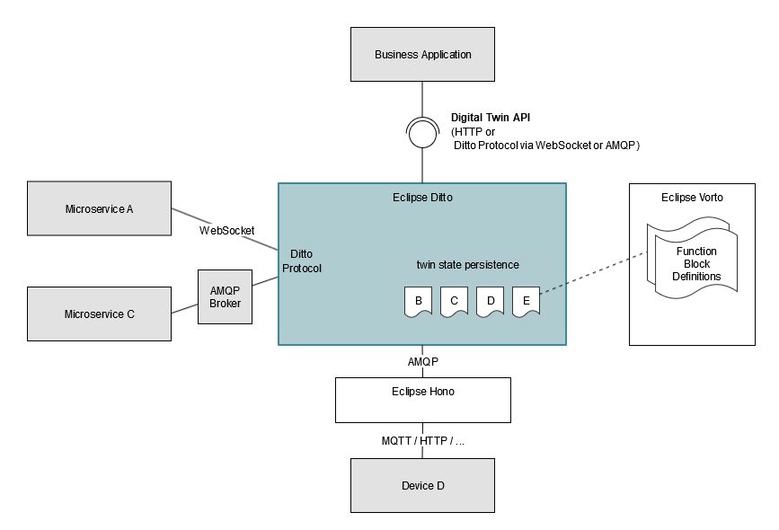
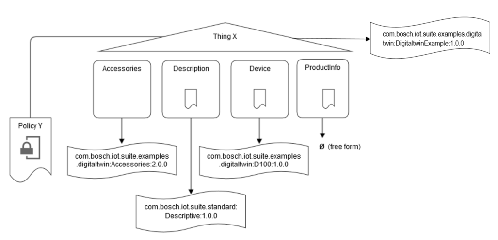
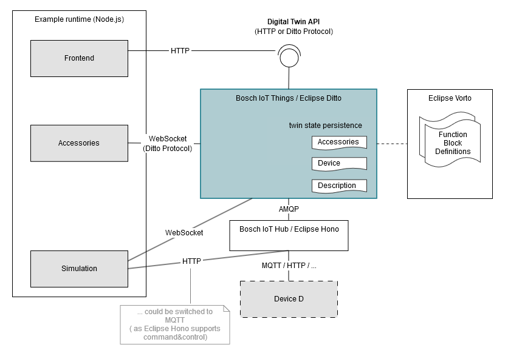

# Bosch IoT Things - End-to-End Digital Twin Example

This example shows a simple End-to-End scenario for Digital Twins based on Eclipse Ditto / Bosch IoT Things.

# General concept

## Introduction

A digital twin is an orchestration of many (all) aspects of an IoT device/product asset in order to get to a unified and simplified model and API to work with this IoT asset.
Each digital twin is represented as Thing in Eclipe Ditto and the aspects a represented as Features within this Thing.\
Some of these Features represent a state with properties, others represent an interface to some functionality (e.g. operations or events), and some are both.

Normally there are "contracts" that define the structure of the state and/or the interfaces of functionality. These contracts are defined using Eclipse Vorto by describing Function Blocks. Some Features may also be "free form", i.e. there is no "written" contract that defines its state/functionality.

Finally, there needs to be a place where the orchestration is described. Policies are used in Eclipse Ditto to manage the orchestration. They include the roles and access rights and by this directly define the responsibility of these roles.

The following conceptual model describe the composition of a Digital Twin in Eclipse Ditto:


## Implementation and Deployment of Digital Twins

A Digital Twin can be implemented by using Eclipse Ditto for managing the orchestration and managing the state information of individual Features. In addition to this, the implementation of custom functionality is provided by custom microservices that are integrated into the overall Digital Twin.
The user of a Digital Twin (e.g. Business Application, Frontend) can interact with the Digital Twins using the state and functionality provided via a single unified API.

All custom microservices that implement functionality of one/multiple Features can be integrated into the Digital Twin by using the Eclipse Ditto protocol via multiple protocol bindings. You can use either a WebSocket binding oder AMQP 1.0 or AMQP 0.91 (RabbitMQ) binding, depending on what is best suited regarding technology and non-functional requirements.

The most important aspect of a Digital Twin is the representation of state and the functionality of the physical device that is connected to the Internet. This integration is done using the same approach and explicitly preapred for integration with Eclipse Hono.

The following diagram shows deployment options for Digital Twin with Eclipse Ditto:



# Example

## Example Digital Twin

This example tries to illustrate the implementation of a Digital Twin with some typical aspects:
- **Device**: a feature that represents the state of a connected device. The device regularly measures a temperature value and has a configured threshold value to adjust the minimum temperature that should be reported to the Digital Twin.
- **Commissioning**: a feature (separate to _Device_) that abstracts the "workflow" to execute all preparation steps for a new device, so that it can be connected afterwards. The workflow interface is included in the Digital Twin in order to be part of the overall orchestration including access control and to support reflecting status of the commissioning process within the Digital win. In the example the commissioning implements the registration of the device in Eclipse Hono.
- **Accessories**: a custom functionality to determine supported accessory products that can be combined with the device (e.g. batteries, spare parts). In real-world scenarios this business functionality could be retrieved from a product catalog system (e.g. via SAP).
- **Descriptive**: a small, reusable aspect with general-purpose descriptive information about a thing, defined as "static" state properties.
- **ProductInfo**: an unstructured set of properties describing more information about the overall product.

Shown all these aspects in the general conceptual model gives the following picture:



## Example microservice implementation

The example implementation includes all the microservices that provide the features of the Digital Twin as well as an exemplary business application ("Frontend") in one single runtime application based on Node.js.
In addition, it adds a simple device simulation microservice that simulates a real physical device by sending telemetry data and respecting configuration data.

:info: The device simulation currently uses the Eclipse Hono HTTP channel to emit telemetry data AND in parallel the Eclipse Ditto WebSocket channel to receive configuration changes. The last one is not proposed for large scale scenarios with high number of device connections but should be replaced by a appropriate device connectivity channel. As soon as Eclipse Hono supports [command&control](https://www.eclipse.org/hono/api/command-and-control-api/) using MQTT the simulation could be switched to it for both channels.

Following the deployment model from above this looks like this:



The policy-based orchestration is based on different (technical) users/subjects that are used for each microservice. These subjects reflect the role each microservice has within the Digital Twin:
You will need users for following roles:
- **owner**: this is a user that owns the overall digital twin. It is set-up to have all access rights on all features and the policy itself. In the example the _Frontend_ user is the onwer of the digital twin.
- **integration**: this is a "virtual" user/subject that is used to define access rights used in the integration with Eclipse Hono. This subject is allowed to write status properties and read configuration properties. As it is "virtual" no real (technical) user entity is required, but any unique, arbitrary subject id can be used for that.
- **simulation**: used by the device simulation microservice to act as replacement for a real phyisical device. It will be configured with the same access rights as the _Integration_ subject.
- **accessories**: as the example accessories microservice uses a message-based interaction pattern ("retrieveSupportedAccessories") this subject requires receive permissions on these messages. The retrieval is based on product information and so this subject requires access on the respective _ProductInfo_ feature also.
- **commissioning**: the commissioning workflow is also integrated using message-based interaction patterns (e.g. "commissionDevice"). Access rights to receive these messages are defined and also access rights to manage the state of the _Commissioning_ feature in order to write result information.

# Prepare

## Use an existing or request a new Bosch IoT Things service instance

Book the Bosch IoT Things cloud service: see [here](https://things.s-apps.de1.bosch-iot-cloud.com/dokuwiki/doku.php?id=002_getting_started:booking:booking)

## Only required device integration/simulation: Use an existing or request a new Bosch IoT Hub tenant

Use the Sandbox of Bosch IoT Hub or request your own evaluation tenant. See [http://docs.bosch-iot-hub.com/] for details.

After you have both instances (Things and Hub) in place, you can setup the integration between the tww.
See [here](https://things.s-apps.de1.bosch-iot-cloud.com/dokuwiki/doku.php?id=005_dev_guide:006_message:007_protocol_bindings:amqp10_binding) for background information.

## Prepare users (subjects) for each microservice

As described above the microservices of a Digital Twin use different (technical) users/subjects. To prepare and manage these subjects you can use [Bosch IoT Permissions](https://www.bosch-iot-suite.com/permissions/).
For evaluation/example scenarios you can alternativly setup some evaluation users as described [here](https://things.s-apps.de1.bosch-iot-cloud.com/dokuwiki/doku.php?id=006_demo:01_createuser)

## Configure your settings

Set your credentials in the file "config.json". You can copy "config.json-template" as template and fill out the placeholders.

# Build and Run

```
npm install
npm run build
npm run start
```

If you need to access the Internet using a Proxy configuration, please make sure to set the environment variable HTTPS_PROXY.

# License
See the iot-things-examples top level README.md file for license details.
